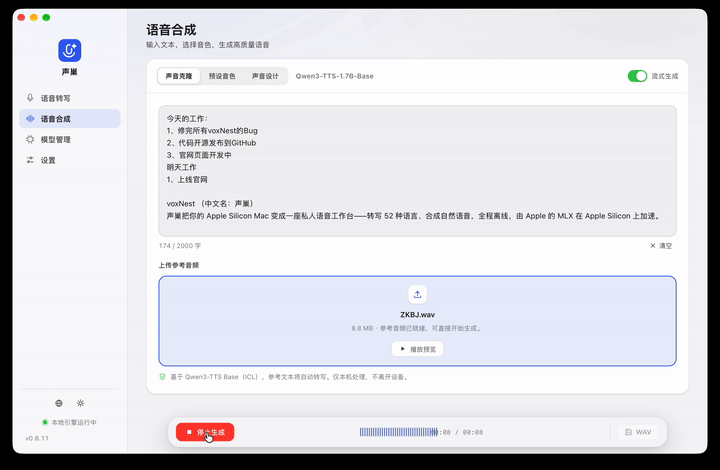

# voxNest · 声巢

> 专为 Apple Silicon Mac 打造的本地 AI 语音工坊 — 开源、离线运行的语音转文字与文字转语音应用。

<div align="center">

[中文](README.zh.md) · [English](README.md)

<br>

<a href="https://github.com/mrtylerwang/voxnest/actions"></a>
<a href="https://github.com/mrtylerwang/voxnest/releases/latest"></a>
<a href="https://github.com/mrtylerwang/voxnest/blob/main/LICENSE"></a>

</div>

<div align="center">
  
</div>

voxNest 把 AI 语音能力完全搬进你的 Mac。所有推理在本地运行，基于 Apple MLX 框架 — 不上传音频、无需账号、无遥测、无订阅。内置 Python 运行时与 ffmpeg，用户安装 dmg 后什么都不用装。

支持 **全系 Apple Silicon Mac**，系统要求 macOS 15 Sequoia 及以上。Intel Mac / Windows / Linux 不支持。

---

## 下载

| 地区 | 下载 |
|---|---|
| 国际 | [`voxNest_aarch64.dmg`](https://github.com/mrtylerwang/voxnest/releases/latest/download/voxNest_aarch64.dmg) |
| 大陆镜像 | [`voxNest_aarch64.dmg (gh-proxy)`](https://gh-proxy.com/https://github.com/mrtylerwang/voxnest/releases/latest/download/voxNest_aarch64.dmg) |
| 全部版本 | [GitHub Releases](https://github.com/mrtylerwang/voxnest/releases) |

1. 双击 `.dmg`，把 **voxNest** 拖进 Applications
2. 启动 — 后端自动启动。首次运行会在 app 数据目录里安装 Python 运行时
3. 在模型管理器下载需要的 ASR 和 TTS 模型（带进度显示，支持断点续传）

### macOS 提示「voxNest 已损坏，无法打开」

首次启动时，macOS Gatekeeper 可能因为 `.dmg` 从网络下载而拦截应用，提示"已损坏"。这是标准的 quarantine 属性，并不是真的损坏。

**解决方法** — 打开终端，运行：

```bash
sudo xattr -r -d com.apple.quarantine /Applications/voxNest.app
```

输入 Mac 密码确认后，重新启动声巢即可。之后不会再出现这个提示。

## 语音转文字 (ASR)

拖入音频文件，得到三种视图：**文稿**（纯文本）、**时间轴**（逐段时间戳）、**SRT**（字幕格式）。

| 模型 | 大小 | 语言 | 特点 |
|---|---|---|---|
| Qwen3-ASR-1.7B-8bit | ~1.8 GB | 52 种语言，自动检测 | 旗舰精度、原生时间戳、自带标点 |
| Fun-ASR-Nano-0.8B | ~250 MB | 中文 + 7 方言、歌词 | 轻量高速 |

## 文字转语音 (TTS) — 三种模式

三个 TTS 变体共享一个 tokenizer 辅助模型（≈ 0.65 GB），首次下载 TTS 模型时自动安装。

| 模式 | 输入 | 模型 | 说明 |
|---|---|---|---|
| **Base（声音克隆）** | 参考音频 | 12Hz-1.7B-Base-8bit | 参考文本由内置 ASR 自动转写，无需手动提供 |
| **CustomVoice（预设）** | 选择音色 | 12Hz-1.7B-CustomVoice-8bit | 9 个内置预设音色；本模式不支持参考音频 |
| **VoiceDesign（声音设计）** | 七维度描述 | 12Hz-1.7B-VoiceDesign-8bit | 性别 + 年龄 + 音调 + 语速 + 情绪 + 音色 + 用途 |

输出经过后处理 — 响度归一化、块边界交叉淡入淡出、尾部静音保留裁剪。

---

## 常见问题

**支持哪些 Mac？**
全系 Apple Silicon Mac（M 系列任意芯片），macOS 15 Sequoia 及以上。Intel Mac、Windows、Linux 不支持 — MLX 框架硬依赖 Apple Silicon。

**需要联网吗？**
仅首次下载模型时需要。之后所有功能完全离线，无需网络。

**三种 TTS 模式怎么选？**
用 **Base** 从参考音频克隆特定声音。用 **CustomVoice** 选 9 个内置预设音色。用 **VoiceDesign** 用自然语言描述想要的声音。

**免费吗？**
voxNest 本身 MIT 协议开源，免费用于个人和商业。模型权重遵循各自协议 — 详见 ModelScope 或 HuggingFace 页面。

**macOS 提示「voxNest 已损坏，无法打开」怎么办？**
这是 Gatekeeper 的 quarantine 属性，因为 `.dmg` 从网络下载触发。解决：`sudo xattr -r -d com.apple.quarantine /Applications/voxNest.app` — 详见上方安装说明。

---

## 链接

| | |
|---|---|
| 官网 | [https://voxnest.cnxc.me/zh/](https://voxnest.cnxc.me/zh/) |
| 国际站 | [https://voxnest.cnxc.me/](https://voxnest.cnxc.me/) |
| 下载 | [GitHub Releases](https://github.com/mrtylerwang/voxnest/releases/latest) |

## 贡献

欢迎提 Issue 和 PR。大改动请先开 Issue 讨论。当前范围有意收敛 — 仅 Apple Silicon macOS、仅 MLX 推理。

## 许可

[MIT](LICENSE). Made with ♥ in Cupertino & Chengdu.
